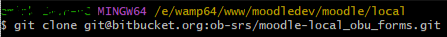
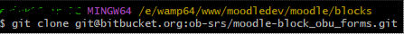
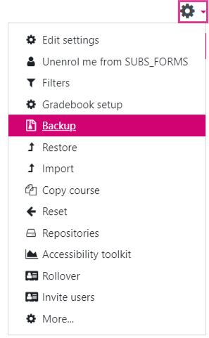
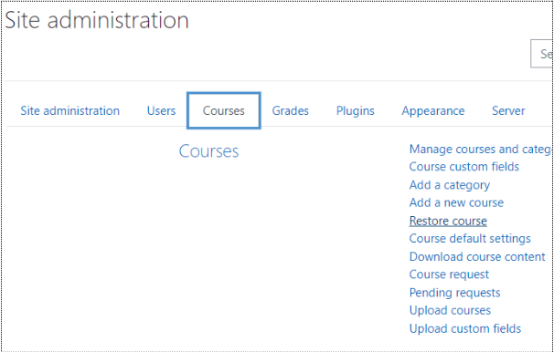
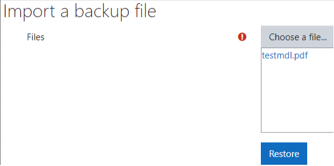
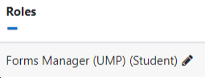
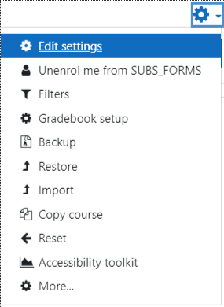
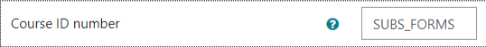
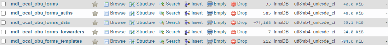
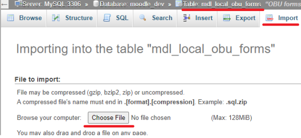

# How to set up the Forms Management plugin

1. Visit [https://bitbucket.org/ob-srs/moodle-local\_obu\_forms/src/master/](https://bitbucket.org/ob-srs/moodle-local_obu_forms/src/master/) and use gitbash to clone the repository from within the **'local'** folder in your local moodle instance.     
Ensure that the new folder created is refactored/renamed to (if not already): **obu\_forms**

2. Visit [https://bitbucket.org/ob-srs/moodle-block\_obu\_forms/src/master/](https://bitbucket.org/ob-srs/moodle-block_obu_forms/src/master/) and use gitbash to clone the repository from within the **'blocks'** folder in your local moodle instance.   

3. After ensuring that you are enrolled onto the Forms Management course on moodle.brookes.ac.uk with the appropriate permissions, click on the settings cog wheel in the top right of the course page and select 'Backup':   
    
    
4. Visit your local Moodle instance and go to Site administration -\> Courses -\> Restore course:   
    
    
5. Drag and drop the file downloaded from step 3 into the designated area and press 'Restore':   
    
    
6. Visit the created 'Forms Management' course and, from the 'Participants' section, enrol your admin user on the course as a Forms Manager:   
    
    
7. Go back to the 'Forms management' page and click on the settings cog wheel in the top right of the course page and select 'Edit settings':     
Ensure that the 'Course ID Number' is set to <b>'SUBS_FORMS'</b>:   
    
    
8. Download and extract the Poodle\_Forms\_Data.zip file in the following drive: [https://drive.google.com/drive/folders/1DVQ7EHe2H\_QfE3a7exuKSAr24Bo2oZZD](https://drive.google.com/drive/folders/1DVQ7EHe2H_QfE3a7exuKSAr24Bo2oZZD)
    
    
9. Log in to your PhpMyAdmin and from within the moodle\_dev database, visit each of the following tables and import the corresponding .sql file from the folder you extracted in step 8 and press go:     
   